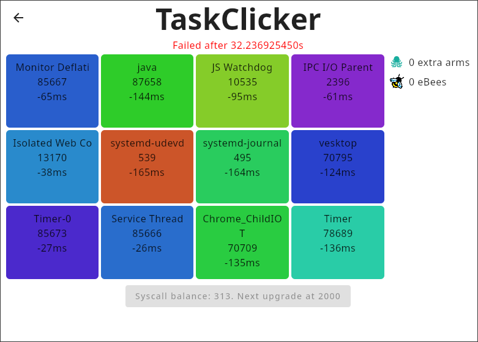

# Taskclicker

*An interactive, fcfs ("first clicked, first served"), gaming scheduler*

Well... As I'm writing this, I'm not sure if this is what I was supposed to build when they tasked me with writing a fcfs scheduler for gaming with focus on interactivity...

But well, it exists now, for better or for worse so have fun:

## What?

Taskclicker let's you experience scheduling first hand, literally. It's a clicker-game scheduler GUI where you have to click on tasks to schedule them. Running tasks earns you syscalls that you can spend on upgrades to make your life easier!

Can you make you system fully interactive before the 30 seconds on a task run out? (Spoiler: This is written with Taskclicker running)

## How?

`sched_ext` via [hello-ebpf](https://github.com/parttimenerd/hello-ebpf/) (custom release at https://mvn.packages.mr-pine.de/#/releases/me/bechberger/bpf until next upstream release), bad code and even worse ideas.

## How to run?

To run the application you have to fulfill the [requirements for hello-ebpf](https://github.com/parttimenerd/hello-ebpf/?tab=readme-ov-file#prerequisites) and have root priviledges.

The easiest way to run `Taskclicker` is `sudo ./gradlew run`. You'll probably have to run something like `xhost si:localuser:root` to let the root user access your X Server.

### Playing

To be able to interact with your scheduler at all while also scheduling tasks with it, you'll need to except some applications from the scheduling.
This is done via the checkboxes in the main menu, select what looks like it is necessary to be able to click the tasks (i.e. your window manager/desktop shell) and then click the test button at the bottom. (This is done automatically for my hyprland setup, feel free to open a PR for your setup)

**Then click play and experience truly interactive scheduling!**

### Resetting

Once you failed or want to try again, you can stop the scheduling either by closing the window or by clicking the arrow in the top left. Currently you need to restart the application for every run.

## Is this production ready?

Yes, please deploy to production.

## Why?

Idk, sounded dumb enough to be funny and https://github.com/parttimenerd/sched-ext-kit-contest was enough motivation.